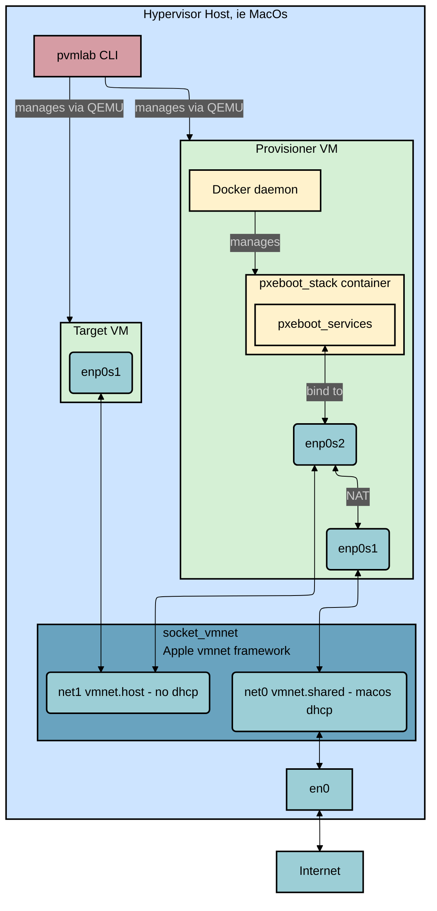

# pvmlab: A Simple QEMU based provisioning lab for macOS

This project provides a command-line tool, `pvmlab`, to automate the setup of a simple virtual provisioning lab on macOS. It uses `QEMU`, `socket_vmnet`, `cloud-init`, and `Docker` to create and manage a two-VM environment.

All generated artifacts (VM disks, ISOs, logs, etc.) are stored neatly in `~/.provisioning-vm-lab/`, keeping the project repository clean.

## Architecture



### Features

- **Go-based CLI:** A modern, easy-to-use command-line interface (`pvmlab`) for managing the entire lab lifecycle.
- **Clean Project Directory:** All generated files are stored outside the project's directory in `~/.provisioning-vm-lab/`.
- **Two role VM Architecture:**
  - **Provisioner VM:** An `aarch64` Ubuntu server that provides pxeboot and NAT services for the target VMs.
  - **Target VM:** An `x86_64` Ubuntu server that sits in the private network and is provisioned by the provisioner VM. The provisioner VM also provides internet access for the target VMs.
- **Isolated Provisioning Network:** Utilizes `socket_vmnet` to create a private host-only network for provisioning services.
- **Internet Access:** The provisioner VM is connected to a shared network for internet access, and provides NAT for the target VMs on the private network.
- **Declarative VM Configuration:** Uses `cloud-init` to declaratively configure both VMs on first boot.
- **Docker Containerization:** Utilizes `Docker` to run a `supervisord` container to manage the pxeboot stack:
  - DHCP server to hand over IP settings to the target VMs
  - TFTP server to serve the iPXE boot files to the target VMs
  - HTTP server to serve initrd, ramdisk, OS images and cloud-init ISOs to the target VMs

### VMs

**Provisioner VM:**

- **OS:** Ubuntu Server 24.04 (aarch64)
- **Role:** `provisioner`, there could be only one provisioner per lab
- **Network Interfaces:**
  - `enp0s1` (WAN): Connects to a shared network with DHCP for internet access.
  - `enp0s2` (LAN): Connects to the private network with a static IP and NAT for the target VMs.
- **Services:** Configured via `cloud-init` to enable IP forwarding and configure NAT.
- **Docker**: Utilizes `Docker` to run the pxeboot stack

**Target VM:**

- **OS:** Ubuntu Server 24.04 (aarch64)
- **Role:** `target`
- **Network Interface:**
  - `enp0s1`: Connects to the private network and obtains its IP from the dhcpd server running on the provisioner VM.

## Artifacts Directory

All files generated by `pvmlab` are stored in a hidden directory in your home folder to keep the project's working directory clean.

The structure of this directory is as follows:

```shell
~/.provisioning-vm-lab/
├── configs/        # Generated cloud-init ISO files (.iso) for each VM
├── docker_images/  # Docker images saved as .tar files to be shared with the provisioner VM
├── images/         # Downloaded Ubuntu cloud image templates
├── logs/           # VM console logs
├── monitors/       # QEMU monitor sockets for interacting with the hypervisor
├── pids/           # Process ID files for running VMs
├── ssh/            # Generated SSH key pair (vm_rsa, vm_rsa.pub) for VM access
└── vms/            # VM disk images (.qcow2) created from the base images
```

## Prerequisites

Things you need to install yourself:

- macOS
- [Homebrew](https://brew.sh/)
- The Go language ecossytem (to build the CLI): use `brew install go`

These will be installed during the setup process:

- QEMU (`qemu`)
- CDRTools (`cdrtools`)
- `socat`
- `docker` installed on your MacOS machine

## Installation

Install dependencies:

```bash
brew install socat socket_vmnet cdrtools qemu
```

Clone the repository:

```bash
git clone https://github.com/pallotron/provisioning-vm-lab.git
```

Install all the things! (pvmlab CLI, socket_vmnet daemons, pxeboot stack docker container...):

```bash
make all
```

Source the completion script.
If you use `zsh`:

```bash
source /opt/homebrew/share/zsh-completions/_pvmlab
```

If you use `bash`:

```bash
source /opt/homebrew/share/bash-completion/completions/pvmlab
```

After installation, you can run the command as `pvmlab` from any directory.
Verify your `GOPATH` and `PATH` variables are correct and you can see the binary:

```bash
which pvmlab
/Users/afailla/.gvm/pkgsets/go1.25.1/global/bin/pvmlab
```

Run the `setup` command. This will use Homebrew to install required packages and create the `~/.provisioning-vm-lab/` directory structure, including an SSH key for accessing the VMs.

It might require sudo password:

```bash
❯ pvmlab setup
Creating provisioning-vm-lab directory structure...
Directory structure created successfully.
Generating SSH keys...
SSH keys generated successfully.
Checking dependencies...
Dependencies checked successfully.
Checking socket_vmnet service status...
```

## Shell Completion

The CLI can generate completion scripts for various shells. This allows you to use the Tab key to auto-complete commands and flags.
This is done by the makefile at installation time.

## Usage

**Start the `socket_vmnet` Service:**

This service manages the private virtual network. You may be prompted for your password.

```bash
pvmlab socket_vmnet start
```

**Create the VMs:**

This command downloads cloud images, creates VM disks, and generates cloud-init configurations in the `~/.provisioning-vm-lab/` directory.

```bash
# Create the provisioner
pvmlab vm create provisioner --role provisioner

# Create a target VM
pvmlab vm create target1
```

**Start the VMs:**

```bash
pvmlab vm start provisioner
pvmlab vm start target1
```

**List VMs:**

```bash
pvmlab vm list
NAME          ROLE          PRIVATE IP      SSH ACCESS                         MAC                 STATUS
| provisioner   | provisioner   | 192.168.100.1   | localhost:<dynamic_port>         | 00:00:DE:AD:BE:EF   | Running           |
client        target        192.168.100.2   192.168.100.2 (from provisioner)   be:30:76:b7:d2:fa   Running
```

**Access the Provisioner VM:**

```bash
pvmlab vm shell provisioner
```

**Access a Target VM:**
First, SSH into the provisioner, then connect to the target's private IP:

```bash
# From your Mac
pvmlab vm shell provisioner
# From inside the provisioner VM, take the IP from dnsmasq (this will improve)
ssh ubuntu@<private IP from DHCPD>
```

**Monitor Logs:**

```bash
pvmlab vm logs provisioner
pvmlab vm logs target1
```

**Stopping the VMs:**

```bash
pvmlab vm stop provisioner
pvmlab vm stop target1
```

**Cleanup:**
To stop a VM and remove its files from `~/.provisioning-vm-lab/`:

```bash
pvmlab vm clean provisioner
```

To clean up everything, including the `socket_vmnet` service and the entire `~/.provisioning-vm-lab/` directory:

```bash
pvmlab clean
```

### Interacting with the pxeboot Container

The provisioner VM has a Docker container running the pxeboot stack.
The container is defined in `pxeboot_stack/Dockerfile` but you can also provide your own (in `.tar` format).
Some commands are defined to manage the container, see `pvmlab vm docker --help`, but you can also use `docker` commands directly
once you are inside the container.

**Get a Shell Inside the Container:**

Get into the provisioner:

```bash
pvmlab vm shell provisioner
```

For debugging, you can get an interactive shell.

```bash
docker exec -it pxeboot_stack /bin/sh
```

**Manage Container Lifecycle:**

Standard `docker` commands apply here:

```bash
# Stop the container
docker stop pxeboot_stack
# Start the container
docker start pxeboot_stack
# Restart the container
docker restart pxeboot_stack

# Cleanup; first, remove any stopped containers that may reference old images
docker container prune
# Then, remove dangling images
docker image prune

# tail files inside the container
docker exec pxeboot_stack tail -f /path/to/file.log
```

#### Building and Reloading the pxeboot Docker Container

The `pxeboot_stack` Docker image is built on your macOS host and then loaded into the provisioner VM.

**Initial Setup:**

When you first create the provisioner VM (`pvmlab vm create provisioner`), the following happens automatically via `cloud-init`:
1.  Docker is installed in the VM.
2.  The `~/.provisioning-vm-lab/docker_images/` directory from your Mac is mounted into the VM at `/mnt/host/docker_images/`.
3.  The `pxeboot_stack.tar` image is loaded into Docker.
4.  The `pxeboot_stack` container is started.

**Development Workflow:**

If you make changes to the `pxeboot_stack` source code (e.g., `Dockerfile`, `supervisord.conf`), you can update the running container without recreating the entire VM:

1.  **On your Mac**, rebuild and save the Docker image:
    ```bash
    make -C pxeboot_stack tar
    ```
    This command builds the image and creates the `pxeboot_stack.tar` file in the `pxeboot_stack` directory.

2.  **Update the container in the provisioner VM**:
    ```bash
    pvmlab vm docker start provisioner pxeboot_stack/pxeboot_stack.tar --network-host --privileged
    ```

3.  **Check the container status**:
    This script stops and removes the old container, loads the updated image from the shared directory, and starts a new container.
    ```bash
    pvmlab vm docker status provisioner
    ```

This allows for a rapid development cycle when working on the provisioning services.

## CLI Commands

| Command                                    | Description                                                      |
| ------------------------------------------ | ---------------------------------------------------------------- |
| `pvmlab setup`                             | Installs dependencies and creates the artifacts directory.       |
| `pvmlab clean`                             | Stops all VMs and services, and removes the artifacts directory. |
| `pvmlab socket_vmnet start`                | Starts the `socket_vmnet` background service.                    |
| `pvmlab socket_vmnet stop`                 | Stops the `socket_vmnet` service.                                |
| `pvmlab socket_vmnet status`               | Checks the status of the `socket_vmnet` service.                 |
| `pvmlab vm create <name>`                  | Creates a new VM. Requires `--role`.                             |
| `pvmlab vm start <name>`                   | Starts the specified VM.                                         |
| `pvmlab vm stop <name>`                    | Stops the specified VM.                                          |
| `pvmlab vm shell <name>`                   | Opens an SSH session to the specified VM.                        |
| `pvmlab vm logs <name>`                    | Tails the console logs for the specified VM.                     |
| `pvmlab vm list`                           | Lists all VMs and their status.                                  |
| `pvmlab vm clean <name>`                   | Stops the VM and deletes its generated files.                    |
| `pvmlab vm docker start <vm> <tar>`        | Starts a docker container inside a VM.                           |
| `pvmlab vm docker stop <vm> <container>`   | Stops a docker container inside a VM.                            |
| `pvmlab vm docker status <vm>`             | Checks the status of docker containers inside a VM.              |

## Project Structure

The project is a Go CLI application with the following structure:

```shell
.
├── internal/               # Internal packages not intended for reuse
├── pvmlab/                 # Main application package
│   ├── cmd/                # Cobra command definitions
│   └── main.go
├── pxeboot_stack/          # Source for the Docker container running the pxeboot stack
├── go.mod                  # Go module definition
├── go.sum                  # Go module dependencies
└── README.md
```

## TODO

### `pxeboot_stack`

The `pxeboot_stack` Docker container currently runs dnsmasq for DHCP, TFTP.
But the plan is to:

- replace `dnsmasq` DHCP with a personalised version of Meta's [`dhcplb`](https://github.com/metacloud/dhcplb).
- keep `dnsmasq` for TFTP
- add `nginx` for webserver to serve:
  - initrd and vmlinuz (kernel) files
  - ipxe script to download the kernel and initrd from nginx
  - OS installer ramdisks
  - disk images
- Need to expose an gRPC API to provision/remove host reservations inside the `dhcplb` instance.
- The `vm list` command should get the private IP of the clients by talking to `dhcplb`.

Also offer functionality to add artifacts like NetworkBootPrograms (NBs), initrds, ramdisks, os images, etc.

### Architectures

Currently everythign is `aarch64`.
The plan is to add `x86_64` support.

### Client VMs accessibility

Currently `pvmlab shell <client>` does not work with client VMs that are on the private `socket_vmnet` network.
You need to `pvmlab shell provisioner` first. Then `ssh ubuntu@<client private IP>`.
This needs improvements, probably via ssh tunnels on the `provisioner` VM.

### Make the system agnostic to the host OS (currently it's MacOS only)

Right now this project is heavily forced to run on macOS. This is because of the `socket_vmnet` service.
The plan is to make this project more generic, so that it can be used on Linux too.

### Start client VMs with interactive mode

Right now client VMs are started in background. It would be nice to have an option which attaches the console
to the user terminal, useful for debugging or when testing pxeboot installation.