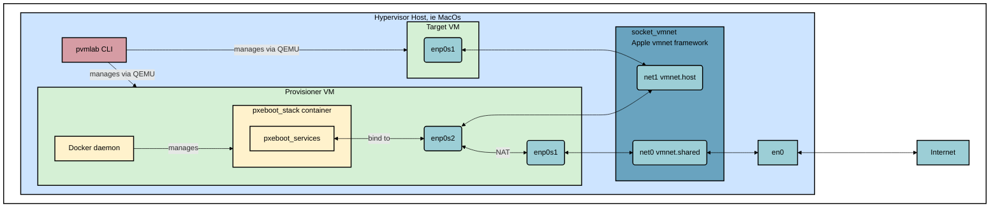

# pvmlab: A Simple QEMU based provisioning lab for macOS

This project provides a command-line tool, `pvmlab`, to automate the setup of a simple virtual provisioning lab on macOS. It uses `QEMU`, `socket_vmnet`, `cloud-init`, and `Docker` to create and manage a two-VM environment.

All generated artifacts (VM disks, ISOs, logs, etc.) are stored neatly in `~/.provisioning-vm-lab/`, keeping the project repository clean.

## Features

- **Go-based CLI:** A modern, easy-to-use command-line interface (`pvmlab`) for managing the entire lab lifecycle.
- **Clean Project Directory:** All generated files are stored outside the project's directory in `~/.provisioning-vm-lab/`.
- **Two-VM Architecture:**
  - **Provisioner VM:** An `aarch64` Ubuntu server that provides network services.
  - **Target VM:** An `x86_64` Ubuntu server that is configured by the lab. (TODO)
- **Isolated Provisioning Network:** Utilizes `socket_vmnet` to create a private host-only network between the VMs.
- **Internet Access via NAT:** The provisioner VM has internet access and acts as a gateway for the target VM.
- **Declarative VM Configuration:** Uses `cloud-init` to declaratively configure both VMs on first boot.
- **Docker Containerization:** Utilizes `Docker` to run the pxeboot stack: DHCP server, TFTP server, and Nginx server.

## Architecture



The lab is composed of two QEMU virtual machines connected to a private virtual network.

**Provisioner VM:**

- **OS:** Ubuntu Server 24.04 (aarch64)
- **Role:** `provisioner`, there could be only one provisioner per lab
- **Network Interfaces:**
  - `enp0s1` (WAN): Connects to the internet via QEMU's `user` network (NAT).
  - `enp0s2` (LAN): Connects to the private network with a static IP of `192.168.100.1`.
- **Services:** Configured via `cloud-init` to enable IP forwarding and configure NAT.
- **Docker**: Utilizes `Docker` to run the pxeboot stack: DHCP server, TFTP server, and Nginx server.

**Target VM:**

- **OS:** Ubuntu Server 24.04 (aarch64)
- **Role:** `target`
- **Network Interface:**
  - `eth0`: Connects to the private network and obtains its IP from the dhcpd server running on the provisioner VM.

## Artifacts Directory

All files generated by `pvmlab` are stored in a hidden directory in your home folder to keep the project's working directory clean.

The structure of this directory is as follows:

```shell
~/.provisioning-vm-lab/
├── configs/        # Generated cloud-init ISO files (.iso) for each VM
├── docker_images/  # Docker images saved as .tar files to be shared with the provisioner VM
├── images/         # Downloaded Ubuntu cloud image templates
├── logs/           # VM console logs
├── monitors/       # QEMU monitor sockets for interacting with the hypervisor
├── pids/           # Process ID files for running VMs
├── ssh/            # Generated SSH key pair (vm_rsa, vm_rsa.pub) for VM access
└── vms/            # VM disk images (.qcow2) created from the base images
```

## Prerequisites

Things you need to install yourself:

- macOS
- [Homebrew](https://brew.sh/)
- The Go language ecossytem (to build the CLI): use `brew install go`

These will be installed during the setup process:

- QEMU (`qemu`)
- CDRTools (`cdrtools`)
- `socat`
- `socket_vmnet`
- `docker` installed on your MacOS machine

## Installation

Clone the repository:

```bash
git clone https://github.com/pallotron/provisioning-vm-lab.git
```

Install all the things! (pvmlab CLI, socket_vmnet daemons, pxeboot stack docker container...):

```bash
make all
```

Source the completion script.
If you use `zsh`:

```bash
source /opt/homebrew/share/zsh-completions/_pvmlab
```

If you use `bash`:

```bash
source /opt/homebrew/share/bash-completion/completions/pvmlab
```

After installation, you can run the command as `pvmlab` from any directory.
Verify your `GOPATH` and `PATH` variables are correct and you can see the binary:

```bash
which pvmlab
/Users/afailla/.gvm/pkgsets/go1.25.1/global/bin/pvmlab
```

Run the `setup` command. This will use Homebrew to install required packages and create the `~/.provisioning-vm-lab/` directory structure, including an SSH key for accessing the VMs.

It might require sudo password:

```bash
❯ pvmlab setup
Creating provisioning-vm-lab directory structure...
Directory structure created successfully.
Generating SSH keys...
SSH keys generated successfully.
Checking dependencies...
Dependencies checked successfully.
Checking socket_vmnet service status...
```

## Shell Completion

The CLI can generate completion scripts for various shells. This allows you to use the Tab key to auto-complete commands and flags.

**For Bash:**

Make sure you have `bash-completion` installed. Then, add the completion script to your setup:

```bash
# macOS (via Homebrew)
pvmlab completion bash > $(brew --prefix)/etc/bash_completion.d/pvmlab
```

**For Zsh:**

Generate the completion script in a directory that is part of your Zsh `fpath`:

```bash
pvmlab completion zsh > "${fpath[1]}/_pvmlab"
```

You will need to restart your shell for the changes to take effect.

## Usage

**Start the `socket_vmnet` Service:**

This service manages the private virtual network. You may be prompted for your password.

```bash
pvmlab socket_vmnet start
```

**Create the VMs:**

This command downloads cloud images, creates VM disks, and generates cloud-init configurations in the `~/.provisioning-vm-lab/` directory.

```bash
# Create the provisioner
pvmlab vm create provisioner --role provisioner

# Create a target VM
pvmlab vm create target1
```

**Start the VMs:**

```bash
pvmlab vm start provisioner
pvmlab vm start target1
```

**List VMs:**

```bash
pvmlab vm list
NAME          ROLE          PRIVATE IP      SSH ACCESS                         MAC                 STATUS
provisioner   provisioner   192.168.100.1   localhost:2222                     00:00:DE:AD:BE:EF   Running
client        target        192.168.100.2   192.168.100.2 (from provisioner)   be:30:76:b7:d2:fa   Running
```

**Access the Provisioner VM:**

```bash
pvmlab vm shell provisioner
```

**Access a Target VM:**
First, SSH into the provisioner, then connect to the target's private IP:

```bash
# From your Mac
pvmlab vm shell provisioner
# From inside the provisioner VM, take the IP from dnsmasq (this will improve)
ssh ubuntu@<private IP from DHCPD>
```

**Monitor Logs:**

```bash
pvmlab vm logs provisioner
pvmlab vm logs target1
```

**Stopping the VMs:**

```bash
pvmlab vm stop provisioner
pvmlab vm stop target1
```

**Cleanup:**
To stop a VM and remove its files from `~/.provisioning-vm-lab/`:

```bash
pvmlab vm clean provisioner
```

To clean up everything, including the `socket_vmnet` service and the entire `~/.provisioning-vm-lab/` directory:

```bash
pvmlab clean
```

### Interacting with the pxeboot Container

The provisioner VM has a Docker container running the pxeboot stack.
The container is defined in `pxeboot_stack/Dockerfile`.

All container management is done **from within the provisioner VM** using standard Docker commands.

**Get a Shell Inside the Container:**

For debugging, you can get an interactive shell.

```bash
docker exec -it pxeboot_stack /bin/sh
```

**Manage Container Lifecycle:**

```bash
# Stop the container
docker stop pxeboot_stack

# Start the container
docker start pxeboot_stack

# Restart the container
docker restart pxeboot_stack
```

**Clean Up Unused Images:**
After reloading the image several times, you may have dangling (untagged) images. You can clean them up to save space.

```bash
# First, remove any stopped containers that may reference old images
docker container prune

# Then, remove dangling images
docker image prune
```

**Tail the dnsmasq-specific log file**:

```bash
docker exec pxeboot_stack tail -f /var/log/dnsmasq.log
```

## CLI Commands

| Command                      | Description                                                      |
| ---------------------------- | ---------------------------------------------------------------- |
| `pvmlab setup`               | Installs dependencies and creates the artifacts directory.       |
| `pvmlab socket_vmnet start`  | Starts the `socket_vmnet` background service.                    |
| `pvmlab socket_vmnet stop`   | Stops the `socket_vmnet` service.                                |
| `pvmlab socket_vmnet status` | Checks the status of the `socket_vmnet` service.                 |
| `pvmlab vm create <name>`    | Creates a new VM. Requires `--role`.                             |
| `pvmlab vm start <name>`     | Starts the specified VM.                                         |
| `pvmlab vm stop <name>`      | Stops the specified VM.                                          |
| `pvmlab vm shell <name>`     | Opens an SSH session to the specified VM.                        |
| `pvmlab vm logs <name>`      | Tails the console logs for the specified VM.                     |
| `pvmlab vm clean <name>`     | Stops the VM and deletes its generated files.                    |
| `pvmlab clean`               | Stops all VMs and services, and removes the artifacts directory. |

## Project Structure

The project is a Go CLI application with the following structure:

```shell
.
├── internal/               # Internal packages not intended for reuse
│   ├── brew/
│   ├── cloudinit/
│   ├── config/
│   ├── downloader/
│   ├── logwatcher/
│   ├── metadata/
│   ├── pidfile/
│   ├── runner/
│   └── socketvmnet/
├── pvmlab/                 # Main application package
│   ├── cmd/                # Cobra command definitions
│   └── main.go
├── pxeboot_stack/          # Source for the Docker container running the pxeboot stack
│   ├── Dockerfile
│   ├── Makefile
│   ├── dnsmasq.conf
│   └── supervisord.conf
├── go.mod                  # Go module definition
├── go.sum                  # Go module dependencies
└── README.md
```

## TODO

### `pxeboot_stack`

The `pxeboot_stack` Docker container currently runs dnsmasq for DHCP, TFTP.
But the plan is to:

- replace `dnsmasq` DHCP with a personalised version of Meta's [`dhcplb`](https://github.com/metacloud/dhcplb).
- keep `dnsmasq` for TFTP
- add `nginx` for webserver to serve:
  - initrd and vmlinuz (kernel) files
  - ipxe script to download the kernel and initrd from nginx
  - OS installer ramdisks
  - disk images
- Need to expose an gRPC API to provision/remove host reservations inside the `dhcplb` instance.
- The `vm list` command should get the private IP of the clients by talking to `dhcplb`.

### Architectures

Currently everythign is `aarch64`.
The plan is to add `x86_64` support.

### Client VMs accessibility

Currently `pvmlab shell <client>` does not work with client VMs that are on the private `socket_vmnet` network.
You need to `pvmlab shell provisioner` first. Then `ssh ubuntu@<client private IP>`.
This needs improvements, probably via ssh tunnels on the `provisioner` VM.

### Make the system agnostic to the host OS (currently it's MacOS only)

Right now this project is heavily forced to run on macOS. This is because of the `socket_vmnet` service.
The plan is to make this project more generic, so that it can be used on Linux too.
