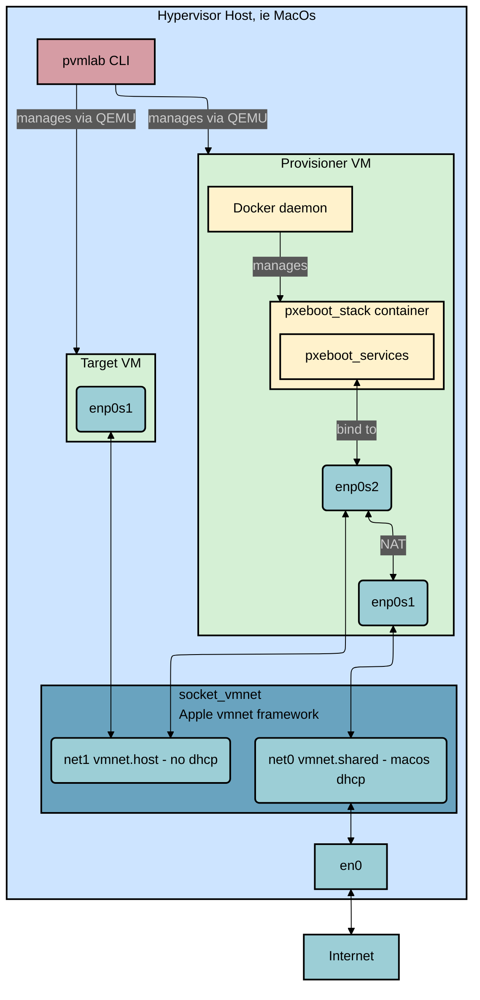

# Architecture

## Features

- **Go-based CLI:** A modern, easy-to-use command-line interface (`pvmlab`) for managing the entire lab lifecycle.
- **Clean Project Directory:** All generated files are stored outside the project's directory in `~/.pvmlab/`.
- **Two role VM Architecture:**
  - **Provisioner VM:** An `aarch64` Ubuntu server that provides pxeboot and NAT services for the target VMs.
  - **Target VM:** An `aarch64` Ubuntu server that sits in the private network and is provisioned by the provisioner VM. The provisioner VM also provides internet access for the target VMs.
- **Isolated Provisioning Network:** Utilizes `socket_vmnet` to create a private host-only network for provisioning services.
- **Internet Access:** The provisioner VM is connected to a shared network for internet access, and provides NAT for the target VMs on the private network.
- **Declarative VM Configuration:** Uses `cloud-init` to declaratively configure both VMs on first boot.
- **Docker Containerization:** Utilizes `Docker` to run a `supervisord` container to manage the pxeboot stack:
  - DHCP server to hand over IP settings to the target VMs
  - TFTP server to serve the iPXE boot files to the target VMs
  - HTTP server to serve initrd, ramdisk, OS images and cloud-init ISOs to the target VMs

## VMs

**Provisioner VM:**

- **OS:** Ubuntu Server 24.04 (aarch64)
- **Role:** `provisioner`, there could be only one provisioner per lab
- **Network Interfaces:**
  - `enp0s1` (WAN): Connects to a shared network with DHCP for internet access.
  - `enp0s2` (LAN): Connects to the private network with a static IP and NAT for the target VMs.
- **Services:** Configured via `cloud-init` to enable IP forwarding and configure NAT.
- **Docker**: Utilizes `Docker` to run the pxeboot stack

**Target VMs:**

- **OS:** Ubuntu Server 24.04 (aarch64)
- **Role:** `target`
- **Network Interface:**
  - `enp0s1`: Connects to the private network and obtains its IP from the dhcpd server running on the provisioner VM.
