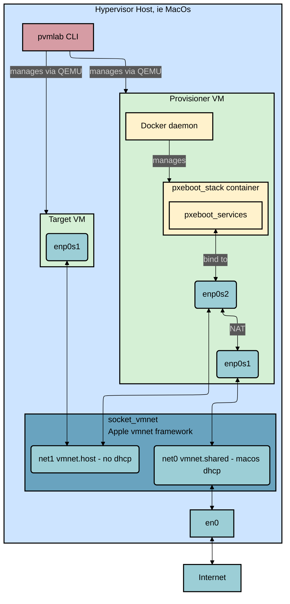

# Architecture

This document provides a detailed explanation of the `pvmlab` architecture, its components, and the provisioning workflow.

## Architecture Overview

The diagram above illustrates the `pvmlab` architecture, which is composed of several key components that work together to create a flexible and powerful virtual lab environment.

### Components

- **Hypervisor Host:** This is the machine where the lab is running, typically a macOS system. It hosts the `pvmlab` CLI, the VMs, and the networking components.
- **`pvmlab` CLI:** The command-line interface is the primary tool for managing the lab. It is responsible for creating, starting, stopping, and deleting VMs, as well as managing the `socket_vmnet` service and the `pxeboot_stack` container. The main entrypoint for the CLI is in [`pvmlab/main.go`](../pvmlab/main.go) and the commands are defined in the [`pvmlab/cmd/`](../pvmlab/cmd/) directory.
- **`socket_vmnet`:** This component leverages Apple's `vmnet.framework` to create virtual networks for the VMs. It provides two networks:
  - `virtual_net0_shared`: A shared network that connects to the host's `en0` interface, providing internet access to the provisioner VM.
  - `virtual_net1_private`: A private, host-only network used for provisioning the target VMs.
- **Provisioner VM:** An `aarch64` Ubuntu server that acts as the provisioning server for the lab. It runs a Docker container with the `pxeboot_stack` to provide the necessary services for network booting the target VMs. Its initial configuration is handled by `cloud-init`, defined in [`internal/cloudinit/cloudinit.go`](../internal/cloudinit/cloudinit.go).
- **Target VM:** An `aarch64` Ubuntu server that is provisioned by the provisioner VM. It obtains its IP address and boot files from the `pxeboot_stack` container.
- **`pxeboot_stack`:** A Docker container running on the provisioner VM that provides a fully automated, distro-agnostic OS installation environment. The container is defined in the [`pxeboot_stack/`](../pxeboot_stack/) directory. While `pvmlab` provides this default implementation, users can supply their own custom Docker container (in `.tar` format) to tailor the provisioning environment to their specific needs. It includes:
  - **`dnsmasq`**: Provides DHCP for IP address assignment and TFTP to serve the initial iPXE bootloader.
  - **`nginx`**: A web server that serves the OS kernel, root filesystems, and acts as a reverse proxy for the boot handler.
  - **`boot_handler`**: A custom Go HTTP server that dynamically generates iPXE boot scripts and provides a JSON-based configuration to the OS installer, making the process stateless and flexible.
  - **Custom Installer**: A generic, Go-based OS installer packaged into a custom `initrd`. It handles disk partitioning, formatting, OS installation from a rootfs tarball, and bootloader setup.

### Network Architecture

The network architecture is designed to provide both isolation and internet access for the VMs.

- The **provisioner VM** has two network interfaces:
  - `enp0s1` is connected to the `virtual_net0_shared` network, which is bridged to the host's `en0` interface. This provides the provisioner VM with internet access.
  - `enp0s2` is connected to the `virtual_net1_private` network, which is a host-only network. This interface is used to provide provisioning services to the target VMs.
- The **target VMs** have a single network interface, `enp0s1`, which is connected to the `virtual_net1_private` network.
- The provisioner VM is configured to act as a **NAT router**, forwarding traffic from the target VMs on the private network to the internet via its `enp0s1` interface.

## Provisioning Flow

The provisioning process in `pvmlab` is designed to be robust and stateless, leveraging a "disk first, network second" boot strategy.

1.  **Initiation**: The `pvmlab` CLI starts the `provisioner` VM. On its first boot, `cloud-init` configures the VM, installs Docker, and starts the `pxeboot_stack` container.

2.  **Target VM First Boot (Blank Disk)**:
    a. The `pvmlab` CLI starts a new `target` VM with a blank virtual disk. The VM's firmware is configured to attempt booting from the disk first, then from the network.
    b. The disk boot **fails** as there is no bootloader.
    c. The firmware automatically falls back to a **network (PXE) boot**.

3.  **PXE Boot Process**:
    a. The `target` VM sends a DHCP request on the private network.
    b. `dnsmasq` (in the `pxeboot_stack` container) responds, assigning an IP address and providing the iPXE network bootloader (`ipxe-*.efi`) via TFTP.
    c. The `target` VM loads iPXE, which then makes an HTTP request to the `boot_handler` service to fetch its boot script.

4.  **Custom Installer Loading**:
    a. The `boot_handler` service dynamically generates an iPXE script for the specific VM.
    b. This script instructs the `target` VM to download two components from the `nginx` server:
        - The **distro-specific kernel** (e.g., `vmlinuz`), which was previously extracted from the official distro ISO.
        - A **generic, custom installer `initrd`**. This RAM disk contains the Go-based OS installer and all necessary tools.
    c. The `target` VM boots this kernel and `initrd`, launching the custom OS installer.

5.  **Automated OS Installation**:
    a. The Go installer starts and fetches a JSON configuration file from the `boot_handler` service. This config contains URLs for the OS root filesystem, cloud-init settings, and other metadata.
    b. The installer completely wipes the target disk and partitions it (EFI and root partitions).
    c. It downloads the OS root filesystem tarball and extracts it to the newly created root partition.
    d. It installs and configures the GRUB bootloader within the new OS environment.
    e. It seeds the new OS with `cloud-init` data, which will configure the system (hostname, users, SSH keys) on its first real boot.
    f. The installer triggers a reboot of the `target` VM.

6.  **Subsequent Boots (Installed OS)**:
    a. The `target` VM starts and again attempts to boot from the disk first.
    b. This time, the boot **succeeds** because the installer has placed a valid GRUB bootloader on the disk.
    c. The VM boots directly into the newly installed operating system. The network boot process is skipped entirely.

This design ensures that re-provisioning is as simple as cleaning the VM's disk (`pvmlab vm clean`), which causes the next boot to automatically fall back to the network and repeat the installation process.
