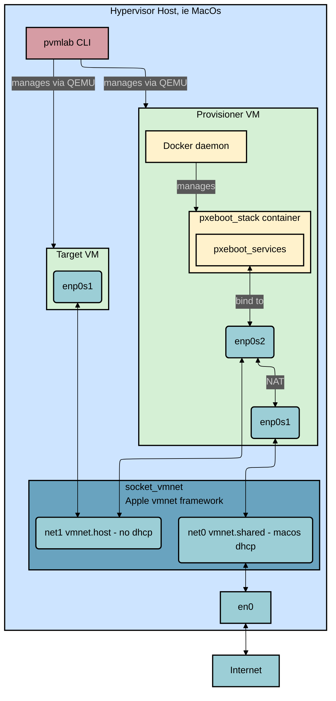

# Architecture

This document provides a detailed explanation of the `pvmlab` architecture, its components, and the provisioning workflow.

## Architecture Overview

The diagram above illustrates the `pvmlab` architecture, which is composed of several key components that work together to create a flexible and powerful virtual lab environment.

### Components

-   **Hypervisor Host:** This is the machine where the lab is running, typically a macOS system. It hosts the `pvmlab` CLI, the VMs, and the networking components.
-   **`pvmlab` CLI:** The command-line interface is the primary tool for managing the lab. It is responsible for creating, starting, stopping, and deleting VMs, as well as managing the `socket_vmnet` service and the `pxeboot_stack` container. The main entrypoint for the CLI is in [`pvmlab/main.go`](../pvmlab/main.go) and the commands are defined in the [`pvmlab/cmd/`](../pvmlab/cmd/) directory.
-   **`socket_vmnet`:** This component, included as a submodule in the [`socket_vmnet/`](../socket_vmnet/) directory, leverages Apple's `vmnet.framework` to create virtual networks for the VMs. It provides two networks:
    -   `virtual_net0_shared`: A shared network that connects to the host's `en0` interface, providing internet access to the provisioner VM.
    -   `virtual_net1_private`: A private, host-only network used for provisioning the target VMs.
-   **Provisioner VM:** An `aarch64` Ubuntu server that acts as the provisioning server for the lab. It runs a Docker container with the `pxeboot_stack` to provide the necessary services for network booting the target VMs. Its initial configuration is handled by `cloud-init`, defined in [`internal/cloudinit/cloudinit.go`](../internal/cloudinit/cloudinit.go).
-   **Target VM:** An `aarch64` Ubuntu server that is provisioned by the provisioner VM. It obtains its IP address and boot files from the `pxeboot_stack` container.
-   **`pxeboot_stack`:** A Docker container running on the provisioner VM that provides the following services. The container is defined in the [`pxeboot_stack/`](../pxeboot_stack/) directory. While `pvmlab` provides this default implementation, users can supply their own custom Docker container (in `.tar` format) to tailor the provisioning environment to their specific needs.
    -   **DHCP:** `dnsmasq` assigns IPv4 and IPv6 addresses to the target VMs. The configuration template is in [`dnsmasq.conf.template`](../pxeboot_stack/dnsmasq.conf.template).
    -   **TFTP:** `dnsmasq` serves the iPXE boot files to the target VMs.
    -   **HTTP:** An HTTP server (to be implemented) will serve the OS installer, cloud-init configuration, and other files to the target VMs.
    -   **IPv6 Router Advertisements:** `dnsmasq` provides IPv6 router advertisements to the target VMs, enabling them to set the provisioner VM as default gateway.

### Network Architecture

The network architecture is designed to provide both isolation and internet access for the VMs.

-   The **provisioner VM** has two network interfaces:
    -   `enp0s1` is connected to the `virtual_net0_shared` network, which is bridged to the host's `en0` interface. This provides the provisioner VM with internet access.
    -   `enp0s2` is connected to the `virtual_net1_private` network, which is a host-only network. This interface is used to provide provisioning services to the target VMs.
-   The **target VMs** have a single network interface, `enp0s1`, which is connected to the `virtual_net1_private` network.
-   The provisioner VM is configured to act as a **NAT router**, forwarding traffic from the target VMs on the private network to the internet via its `enp0s1` interface.

## Provisioning Flow

The following steps outline the automated provisioning process for a target VM:

1.  The `pvmlab` CLI initiates the process by starting the `provisioner` VM.
2.  On its first boot, the `provisioner` VM is configured by `cloud-init`. This setup includes configuring network interfaces, installing Docker, and enabling essential networking services like IP forwarding.
3.  The `provisioner` VM launches the `pxeboot_stack` Docker container.
4.  This container exposes DHCP, TFTP, and (soon) HTTP services on the private network interface, creating a self-contained provisioning environment.
5.  The `pvmlab` CLI then starts a `target` VM.
6.  The `target` VM boots up and initiates a PXE boot sequence over the private network.
7.  The DHCP service within the `pxeboot_stack` assigns an IP address to the `target` VM and points it to the TFTP server for boot files.
8.  The `target` VM downloads and executes the iPXE boot script from the TFTP server.
9.  The iPXE script directs the `target` VM to fetch the operating system installer (kernel and initrd) from the HTTP server.
10. The installer, in turn, retrieves its configuration (e.g., preseed or autoinstall files), which can include a `cloud-init` configuration, also from the HTTP server.
11. The `target` VM completes the OS installation and configuration. It gains internet connectivity through the NAT service provided by the `provisioner` VM.